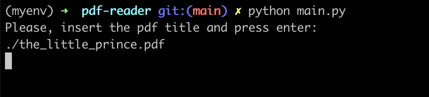

# PDF Reader 📖

This little program takes a pdf file that is passed from the user through the command line and reads it outloud.

## Run the program 🏃🏻‍♀️

Before running this program make sure you have Python3 installed on your machine by typing in your terminal:

`python3 --version`

In case you don't have it, you can download it [here](https://www.python.org/downloads/).

I suggest to [create a virtual environment](https://docs.python.org/3/library/venv.html) and run the following command to install the required packages:

`pip install -r requirements.txt`

⚠️ If you work on a Mac you might need to modify the nsss.py file to avoid a bug by following these steps: 
- Find where you have installed the pyttsx3 package (either on your virtual environment or globally on your machine)
- Open the file `pyttsx3/drivers/nsss.py`
- Edit as [suggested here](https://stackoverflow.com/a/74727956) 

You can now run the program by typing from your command line: 

`python3 main.py`

### Usage example

```bash
python3 main.py
>> Please, insert the pdf title and press enter:
path/to/pdf/and_title.pdf
```

